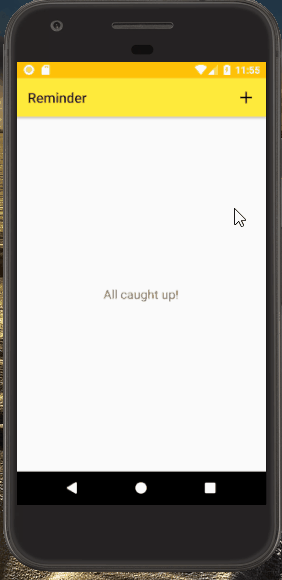

  

<h1 align="center">Reminder-Todo List</h1>

<h5 align = "center">App that reminds you of your pending tasks everyday.</h5>

-----------------------------------------
### Motivation, Challenge & Accomplishment

* **Motivation:** Desire to make my own project in Android and if possible, publish it on Google Play Store after completion of the Udacity Android Nanodegree. This app rose from the need of an application that can do the work of both a 'Reminder' as well as a 'Notes' app, has an intuitive UI and does not need internet.

* **Challenge:** Being able to translate the guided learning from the course to a real-world high quality application and publishing it on the Play Store.

* **Accomplishment:** Published the application on Play Store and currently has 50+ downloads and good reviews.

***

### Features

- `Add a task`: User can add a task with a title, short description and date to be completed by.
- `Modify a task`: User can modify details of a task already entered
- `Delete a task`: User can delete a task once it is completed.
-  No internet is required.
-  Local storage is used.

***

### User Interface

- Tap on :heavy_plus_sign: icon to add a task.
- Tap on :heavy_check_mark: to save the task.
- Tap on already added task to modify it.
- Long press on already added task to delete it.

***

### Demo

    

***

### Installation 

Install the app from the Google Play Store [here](https://play.google.com/store/apps/details?id=com.firstapp.kunj.reminder)

------------------------------------------
### License
This project is licensed under the MIT - see the [LICENSE](./LICENSE) file for details.
